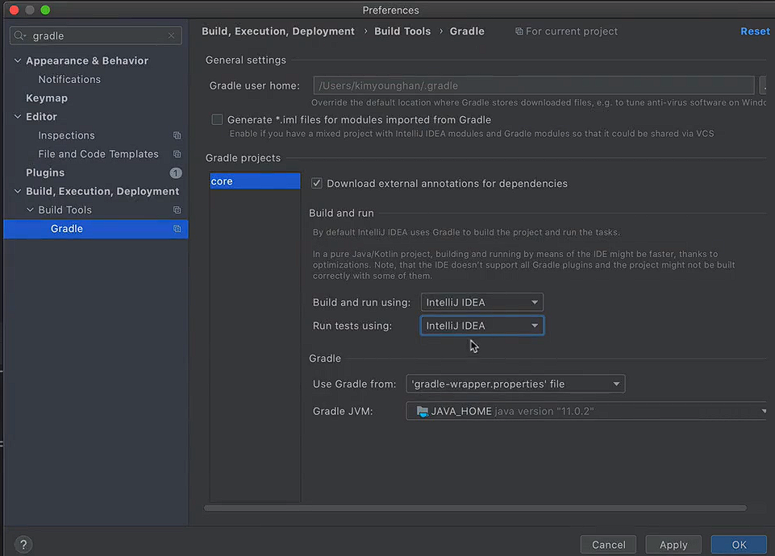

# 프로젝트 생성

**사전 준비물**
- Java 11설치
- IDE: IntelliJ 도는 Eclipse 설치

**스프링 부트 스타터 사이트로 이동해서 스프링 프로젝트 생성**
https://start.spring.io

- 프로젝트 선택
  - Project : **Gradle - Groovy** Project
  - Spring Boot: 2.3.x
  - Language: Java
  - Packaging: Jar
  - Java: 11
- Project Metadata
  - groupId: hello
  - artifactId: core
- Dependencies: 선택하지 않는다

주의! - 스프링 부트 3.0
스프링 부트 3.0을 선택하게 되면 다음 부분을 꼭 확인해주세요.
1. Java 17 이상을 사용해야 합니다.
2. javax 패키지 이름을 jakarta로 변경해야 합니다.
   오라클과 자바 라이센스 문제로 모든 javax 패키지를 jakarta로 변경하기로 했습니다

**패키지 이름 변경 예)**
- **JPA 애노테이션**
  - javax.persistence.Entity -> jakarta.persistence.Entity
- **스프링에서 자주 사용하는 @PostConstruct 애노테이션**
  - javax.annotation.PostConstruct -> jakarta.annotation.PostConstruct
- **스프링에서 자주 사용하는 검증 애노테이션**
  - javax.validation -> jakarta.validation

 
스프링 부트 3.0 관련 자세한 내용은 다음 링크를 확인해주세요: https://bit.ly/springboot3

**Gradle 전체 설정**

`build.gradle`

```groovy
plugins {
  id 'org.springframework.boot' version '2.3.3.RELEASE'
  id 'io.spring.dependency-management' version '1.0.9.RELEASE'
  id 'java'
}

group = 'hello'
version = '0.0.1-SNAPSHOT'
sourceCompatibility = '11'

repositories {
  mavenCentral()
}

dependencies {
  implementation 'org.springframework.boot:spring-boot-starter'
  testImplementation('org.springframework.boot:spring-boot-starter-test') {
    exclude group: 'org.junit.vintage', module: 'junit-vintage-engine'
  }
}

test {
  useJUnitPlatform()
}
```

- 동작 확인
  - 기본 메인 클래스 실행( CoreApplication.main() )

**IntelliJ Gradle 대신에 자바 직접 실행**

최근 IntelliJ 버전은 Gradle을 통해서 실행 하는 것이 기본 설정이다. 이렇게 하면 실행속도가 느리다.
다음과 같이 변경하면 자바로 바로 실행해서 실행속도가 더 빠르다

- Preferences -> Build, Execution, Deployment -> Build Tools -> Gradle
  - Build and run using: Gradle -> IntelliJ IDEA
  - Run tests using: Gradle -> IntelliJ IDEA

