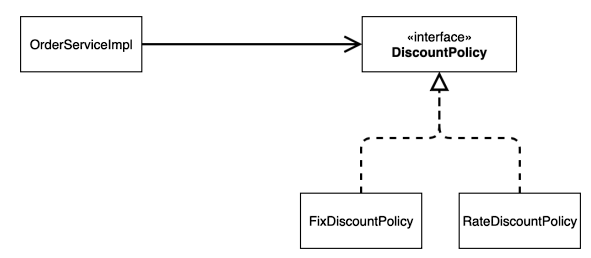
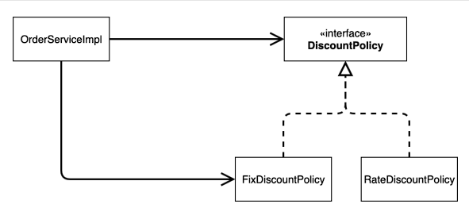
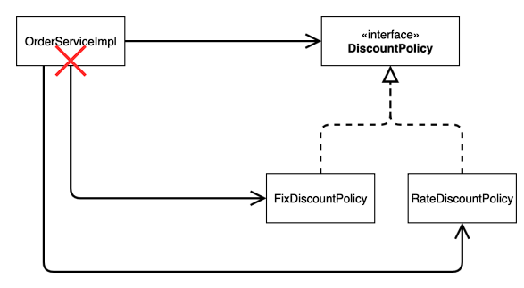
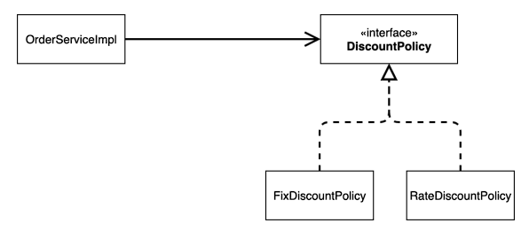

# 새로운 할인 정책 적용과 문제점

**추가한 할인 정책을 적용해보자**

할인 정책을 변경하려면 클라이언트인 `OrderServiceImpl` 코드를 수정해야 한다.

```java
public class OrderServiceImpl implements OrderService {
    // private final DiscountPolicy discountPolicy = new FixDiscountPolicy();
    private final DiscountPolicy discountPolicy = new RateDiscountPolicy();
}
```

**문제점 발견**

- 우리는 역할과 구현을 충실하게 분리했다. -> OK
- 다형성도 활용하고, 인터페이스와 구현 객체를 분리했다. -> OK
- OCP, DCIP 같은 객체지향 설계 원칙을 충실히 준수했다.
    - -> 그렇게 보이지만 사실은 아니다.
- DIP: 주문서비스 클라이언트(OrderServiceImpl)는 DiscountPolicy 인터페이스에 의존하면서 DIP를 지킨 것 같은데?
    - -> 클래스 의존관곌를 분석해보면, 추상(인터페이스) 뿐만 아니라 **구체(구현)클래스에도 의존**하고 있다.
        - 추상(인터페이스) 의존: DiscountPolicy
        - 구체(구현) 클래스: FixDiscountPolicy , RateDiscountPolicy
- OCP: 변경하지 않고 확장할 수 있다고 했는데!
    - 지금 코드는 기능을 확장해서 변경하면, 클라이언트 코드에 영향을 준다! 따라서 OCP를 위반한다

**왜 클라이언트 코드를 변경해야 할까?**

클래스 다이어그램으로 의존관계를 분석해보자.

**기대했던 의존관계**



**실제 의존관계**



잘보면 클라이언트인 `OrderServiceImpl` 이 `DiscountPolicy` 인터페이스 뿐만 아니라
`FixDiscountPolicy` 인 구체 클래스도 함께 의존하고 있다. 실제 코드를 보면 의존하고 있다! **DIP 위반**

**정책 변경**



**중요!** : 그래서 `FixDiscountPolicy`를 `RateDiscountPolicy`로 변경하는 순간 `OrderServiceImpl`의 소스 코드도 함께 변경 해야 한다.
**OCP 위반**

**어떻게 문제를 해결할 수 있을까?**

- 클라이언트 코드인 `OrderServiceImpl`은 `DiscountPolicy`의 인터페이스 뿐만 아니라 구체 클래스도 함께 의존한다.
- 그래서 구체 클래스를 변경할 때 클라이언트 코드도 함께 변경해야 한다.
- **DIP 위반** -> 추상에만 의존하도록 변경해야 한다.
- DIP를 위반하지 않도록 인터페이스에만 의존하도록 의존관계를 변경하면 된다.

**인터페이스에만 의존하도록 설계를 변경하자**



**인터페이스에만 의존하도록 코드 변경**

```java
public class OrderServiceImpl implements OrderService {
    //private final DiscountPolicy discountPolicy = new RateDiscountPolicy();
    private DiscountPolicy discountPolicy;
}
```

- 인터페이스에만 의존하도록 설계와 코드를 변경했다.
- **그런데 구현체가 없는데 어떻게 코드를 실행할 수 있을까?**
- 실제 실행을 해보면 NPE(null pointer exception)가 발생한다.

**해결방안**
- 이 문제를 해결하려면 누군가가 클라이언트인 `OrderServiceImpl`에 `DiscountPolicy`의 구현 객체를 대신 생성하고 주입해주어야 한다.
