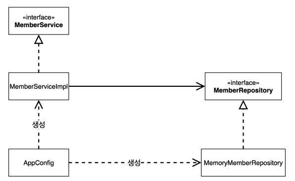
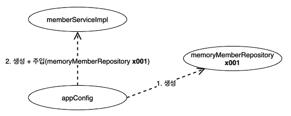

# 관심사의 분리

- 애플리케이션을 하나의 공연이라 생각해보자. 각각의 인터페이스를 배역(배우 역할)이라 생각하자. 그런데!
  실제 배역 맞는 배우를 선택하는 것은 누가 하는가?
- 로미오와 줄리엣 공연을 하면 로미오 역할을 누가 할지 줄리엣 역할을 누가 할지는 배우들이 정하는게
  아니다. 이전 코드는 마치 로미오 역할(인터페이스)을 하는 레오나르도 디카프리오(구현체, 배우)가 줄리엣
  역할(인터페이스)을 하는 여자 주인공(구현체, 배우)을 직접 초빙하는 것과 같다. 디카프리오는 공연도
  해야하고 동시에 여자 주인공도 공연에 직접 초빙해야 하는 다양한 책임을 가지고 있다.

**관심사를 분리하자**

- 배우는 본인의 역할인 배역을 수행하는 것에만 집중해야 한다.
- 디카프리오는 어떤 여자 주인공이 선택되더라도 똑같이 공연을 할 수 있어야 한다.
- 공연을 구성하고, 담당 배우를 섭외하고, 역할에 맞는 배우를 지정하는 책임을 담당하는 별도의 공연
  기획자가 나올시점이다.
- 공연 기획자를 만들고, 배우와 공연 기획자의 책임을 확실히 분리하자.

## AppConfig 등장

```java
package hello.core;

import hello.core.discount.FixDiscountPolicy;
import hello.core.member.MemberService;
import hello.core.member.MemberServiceImpl;
import hello.core.member.MemoryMemberRepository;
import hello.core.order.OrderService;
import hello.core.order.OrderServiceImpl;

public class AppConfig {
    public MemberService memberService() {
        return new MemberServiceImpl(new MemoryMemberRepository());
    }

    public OrderService orderService() {
        return new OrderServiceImpl(
                new MemoryMemberRepository(),
                new FixDiscountPolicy());
    }
}
```

- AppConfig는 애플리케이션의 실제 동작에 필요한 **구현 객체를 생성한다**
    - `MemberServiceImpl`
    - `MemoryMemberRepository`
    - `OrderServiceImpl`
    - `FixDiscountPolicy`
- AppConfig는 생성한 객체 인스턴스의 참조(레퍼런스)를 **생성자를 통해서 주입(연결)해준다**
    - `MemberServiceImpl` -> `MemoryMemberRepository`
    - `OrderServiceImpl` -> `MemoryMemberRepository` , `FixDiscountPolicy`

> 참고: 지금은 각 클래스에 생성자가 없어서 컴파일 오류가 발생한다. 바로 다음에 코드에서 생성자를
> 만든다

**MemberServiceImpl - 생성자 주입**

```java
package hello.core.member;

public class MemberServiceImpl implements MemberService {
    private final MemberRepository memberRepository;

    public MemberServiceImpl(MemberRepository memberRepository) {
        this.memberRepository = memberRepository;
    }

    public void join(Member member) {
        memberRepository.save(member);
    }

    public Member findMember(Long memberId) {
        return memberRepository.findById(memberId);
    }
}
```

- 설계 변경으로 MemberServiceImpl 은 MemoryMemberRepository 를 의존하지 않는다!
  단지 MemberRepository 인터페이스만 의존한다.
- MemberServiceImpl 입장에서 생성자를 통해 어떤 구현 객체가 들어올지(주입될지)는 알 수 없다.
- MemberServiceImpl 의 생성자를 통해서 어떤 구현 객체를 주입할지는 오직 외부( AppConfig )에서
  결정된다.
- MemberServiceImpl 은 이제부터 의존관계에 대한 고민은 외부에 맡기고 실행에만 집중하면 된다

**그림 - 클래스 다이어그램**



- 객체의 생성과 연결은 AppConfig 가 담당한다.
- **DIP 완성**: MemberServiceImpl 은 MemberRepository 인 추상에만 의존하면 된다. 이제 구체 클래스를
  몰라도 된다.
- **관심사의 분리**: 객체를 생성하고 연결하는 역할과 실행하는 역할이 명확히 분리되었다

**그림 - 회원 객체 인스턴스 다이어그램**



- appConfig 객체는 `memoryMemberRepository` 객체를 생성하고 그 참조값을 `memberServiceImpl` 을
  생성하면서 생성자로 전달한다.
  클라이언트인 `memberServiceImpl` 입장에서 보면 의존관계를 마치 외부에서 주입해주는 것 같다고 해서
  DI(Dependency Injection) 우리말로 의존관계 주입 또는 의존성 주입이라 한다.

**OrderServiceImpl - 생성자 주입**

```java
package hello.core.order;

import hello.core.discount.DiscountPolicy;
import hello.core.member.Member;
import hello.core.member.MemberRepository;

public class OrderServiceImpl implements OrderService {
    private final MemberRepository memberRepository;
    private final DiscountPolicy discountPolicy;

    public OrderServiceImpl(MemberRepository memberRepository, DiscountPolicy
            discountPolicy) {
        this.memberRepository = memberRepository;
        this.discountPolicy = discountPolicy;
    }

    @Override
    public Order createOrder(Long memberId, String itemName, int itemPrice) {
        Member member = memberRepository.findById(memberId);
        int discountPrice = discountPolicy.discount(member, itemPrice);
        return new Order(memberId, itemName, itemPrice, discountPrice);
    }
}
```

- 설계 변경으로 `OrderServiceImpl` 은 `FixDiscountPolicy` 를 의존하지 않는다!
- 단지 `DiscountPolicy` 인터페이스만 의존한다.
- `OrderServiceImpl` 입장에서 생성자를 통해 어떤 구현 객체가 들어올지(주입될지)는 알 수 없다.
- `OrderServiceImpl` 의 생성자를 통해서 어떤 구현 객체을 주입할지는 오직 외부( `AppConfig` )에서
  결정한다.
- `OrderServiceImpl` 은 이제부터 실행에만 집중하면 된다
- `OrderServiceImpl` 에는 `MemoryMemberRepository`, `FixDiscountPolicy` 객체의 의존관계가
  주입된다

## AppConfig 실행

**사용 클래스 - MemberApp**

```java
package hello.core;

import hello.core.member.Grade;
import hello.core.member.Member;
import hello.core.member.MemberService;

public class MemberApp {
    public static void main(String[] args) {
        AppConfig appConfig = new AppConfig();
        MemberService memberService = appConfig.memberService();
        Member member = new Member(1L, "memberA", Grade.VIP);
        memberService.join(member);
        Member findMember = memberService.findMember(1L);
        System.out.println("new member = " + member.getName());
        System.out.println("find Member = " + findMember.getName());
    }
}
```

**사용 클래스 - OrderApp**

```java
package hello.core;

import hello.core.member.Grade;
import hello.core.member.Member;
import hello.core.member.MemberService;
import hello.core.order.Order;
import hello.core.order.OrderService;

public class OrderApp {
    public static void main(String[] args) {
        AppConfig appConfig = new AppConfig();
        MemberService memberService = appConfig.memberService();
        OrderService orderService = appConfig.orderService();
        long memberId = 1L;
        Member member = new Member(memberId, "memberA", Grade.VIP);
        memberService.join(member);
        Order order = orderService.createOrder(memberId, "itemA", 10000);
        System.out.println("order = " + order);
    }
}
```

**테스트 코드 오류 수정**

```java
class MemberServiceTest {
    MemberService memberService;

    @BeforeEach
    public void beforeEach() {
        AppConfig appConfig = new AppConfig();
        memberService = appConfig.memberService();
    }
}
```

```java
class OrderServiceTest {
    MemberService memberService;
    OrderService orderService;

    @BeforeEach
    public void beforeEach() {
        AppConfig appConfig = new AppConfig();
        memberService = appConfig.memberService();
        orderService = appConfig.orderService();
    }
}
```

테스트 코드에서 `@BeforeEach` 는 각 테스트를 실행하기 전에 호출된다.

**정리**
- AppConfig를 통해서 관심사를 확실하게 분리했다.
- 배역, 배우를 생각해보자.
- AppConfig는 공연 기획자다.
- AppConfig는 구체 클래스를 선택한다. 배역에 맞는 담당 배우를 선택한다. 애플리케이션이 어떻게
  동작해야 할지 전체 구성을 책임진다.
- 이제 각 배우들은 담당 기능을 실행하는 책임만 지면 된다. 
- `OrderServiceImpl`은 기능을 실행하는 책임만 지면 된다.