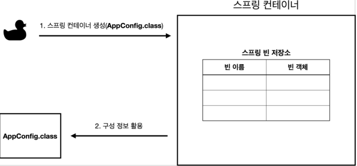
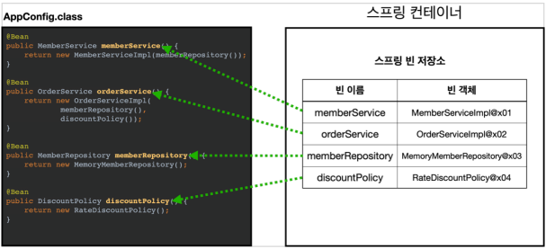
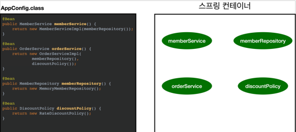
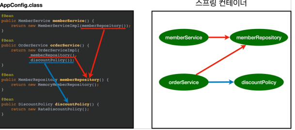

# 스프링 컨테이너 생성

## 스프링 컨테이너가 생성되는 과정

```java
//스프링 컨테이너 생성
ApplicationContext applicationContext =
        new AnnotationConfigApplicationContext(AppConfig.class);
```

- `ApplicationContext`를 스프링 컨테이너라 한다.
- `ApplicationContext`는 인터페이스이다.
- 스프링 컨테이너는 XML을 기반으로 만들 수 있고, 애노테이션 기반의 자바 설정 클래스로 만들 수 있다.
- 직전에 `AppConfig`를 사용했던 방식이 애노테이션 기반의 자바 설정 클래스로 스프링 컨테이너를 만든 것이다.
- 자바 설정 클래스를 기반으로 스프링 컨테이너(`ApplicationContext`)를 만들어보자.
- `new AnnotationConfigApplicationContext(AppConfig.class);`
- 이 클래스는 `ApplicationContext` 인터페이스의 구현체이다.

> **참고** : 정확히 스프링 컨테이너를 부를 때 `BeanFactory`, `ApplicationContext`를 구분해서 부른다.  
> 일반적으로 ApplicationContext를 스프링 컨테이너라 부른다.

## 스프링 컨테이너의 생성 과정

### 1. 스프링 컨테이너 생성



- `new AnnotationConfigApplicationContext(AppConfig.class)`
- 스프링 컨테이너를 생성할 때는 구성 정보를 지정해주어야 한다.
- 여기서는 `AppConfig.class`를 구성 정보로 지정했다.

### 2. 스프링 빈 등록



- 스프링 컨테이너는 파라미터로 넘어온 설정 클래스를 사용해서 스프링 빈을 등록한다.

### 빈 이름
- 빈 이름은 메서드 이름을 사용한다
- 빈 이름을 직접 부여할 수 있다
- `@Bean(name = "memberService2")`

> **주의**: **빈 이름은 항상 다른 이름을 부여**해야한다. 같은 이름일 경우 다른 빈이 무시되거나 기존 빈을 덮어버린다

### 3. 스프링 빈 의존관계 설정 - 준비



### 4. 스프링 빈 의존관계 설정 - 완료


- 스프링 컨테이너는 설정 정보를 참고해서 의존관계를 주입한다.
- 단순히 자바 코드를 호출하는 것 같지만, 차이가 있다

> **참고**: 스프링 빈을 생성하고, 의존관계를 주입하는 단계가 나누어져 있다.  
> 그런데 이렇게 자바 코드를 스프링 빈을 등록하면 생성자를 호출하면서 의존관계 주입도 한 번에 처리된다.  
> 여기서는 이해를 돕기 위해 개념적으로 나누어 설명했다

### 정리
스프링 컨테이너를 생성하고, 설정(구성)정보를 참고해서 스프링 빈도 등록하고, 의존관계도 설정했다
