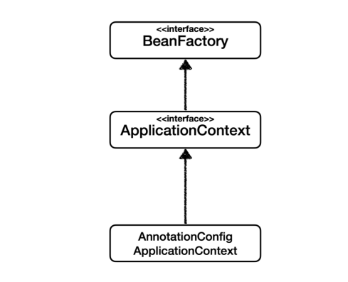
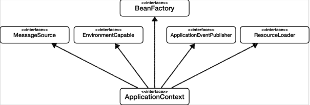

# BeanFactory와 ApplicationContext

BeanFactory와 ApplicationContext

## BeanFactory
- 스프링 컨테이너의 최상위 인터페이스
- 스프링 빈을 관리하고 조회하는 역할을 담당한다
- `getBean()`을 제공한다
- 지금까지 우리가 사용했던 대부분의 기능은 BeanFactory가 제공하는 기능이다

## ApplicationContext
- BeanFactory 기능을 모두 상속받아 제공한다
- 빈을 관리하고 검색하는 기능을 BeanFactory가 제공해주는데, 그러면 둘의 차이가 뭘까?
- 애플리케이션을 개발할 때는 빈을 관리하고 조회하는 기능은 물론이고, 수 많은 부가 기능이 필요하다

## ApplicationContext가 제공하는 부가 기능

- **메시지 소스를 활용한 국제화 기능**
  - 한국에서 들어오면 한국어로, 영어권에서 들어오면 영어로 출력
- **환경 변수**
  - 로컬, 개발, 운영 등을 구분해서 처리
- **애플리케이션 이벤트**
  - 이벤트를 발행하고 구독하는 모델을 편리하게 지원
- **편리한 리소스 조회**
  - 파일, 클래스 패스, 외부 등에서 리소스를 편리하게 조회

### 정리

- ApplicationContext는 BeanFactory의 기능을 상속 받는다
- ApplicationContext는 빈 관리기능 + 편리한 부가 기능을 제공한다
- BeanFactory를 직접 사용할 일은 거의 없다. 부가 기능이 포함된 ApplicationContext를 사용한다.
- BeanFactory나 ApplicationContext를 스프링 컨테이너라 한다.