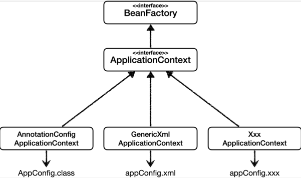

# 다양한 설정 형식 지원 - 자바 코드, XML

- 스프링 컨테이너는 다양한 형식의 설정 정보를 받아드릴 수 있게 유연하게 설계되어 있다
    - 자바 코드, XML, Groovy 등등



## 애노테이션 기반 자바 코드 설정 사용

- 지금까지 했던 것이다
- `new AnnotationConfigApplicationContextAppConfig(AppConfig.class)`
- `AnnotationConfigApplicationContext` 클래스를 사용하면서 자바 코드로된 설정 정보를 넘기면 된다.

## XML 설정 사용

- 최근에는 스프링 부트를 많이 사용하면서 XMl 기반의 설정은 잘 사용하지 않는다. 아직 많은 레거시 프로젝트들이 XML로 되어있고, XML을 사용하여 컴파일 없이 빈 설정 정볼르 변경할 수 있는 장점도 있으므로
  숙지해두는 것도 괜찮다.
- `GenericXmlApplicationContext`를 사용하면서 `xml` 설정 파일을 넘기면 된다.

### XmlAppConfig 사용 자바 코드

```java
package hello.core.xml;

import hello.core.member.MemberService;
import org.junit.jupiter.api.Test;
import org.springframework.context.ApplicationContext;
import org.springframework.context.support.GenericXmlApplicationContext;

import static org.assertj.core.api.Assertions.*;

public class XmlAppContext {
    @Test
    void xmlAppContext() {
        ApplicationContext ac = new GenericXmlApplicationContext("appConfig.xml");

        MemberService memberService = ac.getBean("memberService", MemberService.class);
        assertThat(memberService).isInstanceOf(MemberService.class);
    }
}
```

### XML 기반의 스프링 빈 설정 정보

`src/main/resources/appConfig.xml`

```xml
<?xml version="1.0" encoding="UTF-8"?>
<beans xmlns="http://www.springframework.org/schema/beans"
       xmlns:xsi="http://www.w3.org/2001/XMLSchema-instance"
       xsi:schemaLocation="http://www.springframework.org/schema/beans http://
www.springframework.org/schema/beans/spring-beans.xsd">
    <bean id="memberService" class="hello.core.member.MemberServiceImpl">
        <constructor-arg name="memberRepository" ref="memberRepository"/>
    </bean>
    <bean id="memberRepository"
          class="hello.core.member.MemoryMemberRepository"/>
    <bean id="orderService" class="hello.core.order.OrderServiceImpl">
        <constructor-arg name="memberRepository" ref="memberRepository"/>
        <constructor-arg name="discountPolicy" ref="discountPolicy"/>
    </bean>
    <bean id="discountPolicy" class="hello.core.discount.RateDiscountPolicy"/>
</beans>
```

- xml 기반의 `appConfig.xml` 스프링 설정 정보와 자바 코드로 된 `AppConfig.java` 설정 정보를 비교해보면 거의 비슷하다는 것을 알 수 있다.
- 자세한 사항은 스프링 공식 레퍼런스 문서를 확인하자
  - https://spring.io/projects/spring-framework
