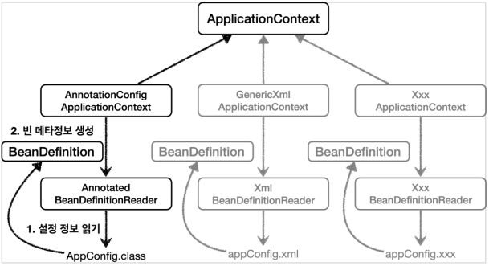

# 스프링 빈 메타 설정 정보 - BeanDefinition

- 스프링이 이런 다양한 설정 정보를 지원할 수 있는 이유는 `BeanDefinition`이라는 추상화가 있기 때문이다
- 쉽게 이야기해서 **역할과 구현을 개념적으로 나눈 것**이다!
    - XML을 읽어서 BeanDefinition을 만들면 된다
    - 자바 코드를 읽어서 BeanDefinition을 만들면 된다
    - 스프링 컨테이너는 자바 코드인지, XMl인지 몰라도 된다. 오직 BeanDefinition만 열면 된다
- `BeanDefinition`을 빈 설정 메타정보라 한다
    - `@Bean`, `<bean>`당 각각 하나씩 메타 정보가 생성된다
- 스프링 컨테이너는 이 메타정보를 기반으로 스프링 빈을 생성한다


**코드 레벨**



- `AnnotationConfigApplicationContext`는 `AnnotationBeanDefinitionReader`를 사용해서 `AppConfig.class`를 읽고 `BeanDefinition`을
  생성한다
- `GenericXmlApplicationContext`는 `XmlBeanDefinitionReader`를 사용해서 `appConfig.xml` 설정 정보를 읽고 `BeanDefinition`을 생성한다
- 새로운 형식의 설정 정보가 추가되면, XxxBeanDefinitionReader를 만들어서 `BeanDefinition`을 생성하면 된다

## BeanDefinition 살펴보기

### BeanDefinition 정보

- BeanClassName: 생성할 빈의 클래스 명(자바 설정 처럼 팩토리 역할의 빈을 사용하면 없음)
- factoryBeanName: 팩토리 역할의 빈을 사용할 경우 이름, 예) appConfig
- factoryMethodName: 빈을 생성할 팩토리 메서드 지정, 예) memberService
- Scope: 싱글톤(기본값)
- lazyInit: 스프링 컨테이너를 생성할 때 빈을 생성하는 것이 아니라, 실제 빈을 사용할 때까지 최대한 생성을 지연 처리 하는 지 여부
- InitMethodName: 빈을 생성하고, 의존관계를 적용한 뒤에 호출되는 초기화 메서드 명
- DestroyMethodName: 빈의 생명주기가 끝나서 제거하기 직전에 호출되는 메서드 명
- Constructor arguments, Properties: 의존관계 주입에서 사용한다 (자바 설정 처럼 팩토리 역할의 빈을 사용하면 없음)

```java
package hello.core.beandefinition;

import hello.core.AppConfig;
import org.junit.jupiter.api.DisplayName;
import org.junit.jupiter.api.Test;
import org.springframework.beans.MutablePropertyValues;
import org.springframework.beans.factory.config.BeanDefinition;
import org.springframework.beans.factory.config.ConstructorArgumentValues;
import org.springframework.context.annotation.AnnotationConfigApplicationContext;
import org.springframework.context.support.GenericXmlApplicationContext;

public class BeanDefinitionTest {
    AnnotationConfigApplicationContext ac = new
            AnnotationConfigApplicationContext(AppConfig.class);

    // GenericXmlApplicationContext ac = new 
    GenericXmlApplicationContext("appConfig.xml");

    @Test
    @DisplayName("빈 설정 메타정보 확인")
    void findApplicationBean() {
        String[] beanDefinitionNames = ac.getBeanDefinitionNames();
        for (String beanDefinitionName : beanDefinitionNames) {
            BeanDefinition beanDefinition =
                    ac.getBeanDefinition(beanDefinitionName);
            if (beanDefinition.getRole() == BeanDefinition.ROLE_APPLICATION) {
                System.out.println("beanDefinitionName" + beanDefinitionName +
                        " beanDefinition = " + beanDefinition);
            }
        }
    }
}
```

### 정리
- BeanDefinition을 직접 생성해서 스프링 컨테이너에 등록할 수도 있다.
- BeanDefinition에 대해서 깊이있게 이해하기 보다는 스프링이 다양한 형태의 설정 정보를 BeanDefinition으로 추상화해서 사용하는 것 정도만 이해하면 된다
- 가끔 스프링 코드나 스프링 관련 오픈 소스의 코드를 볼 때, BeanDefinition 이라는 것이 보일 때가 있다 이때 이러한 메커니즘을 떠올리면 된다
