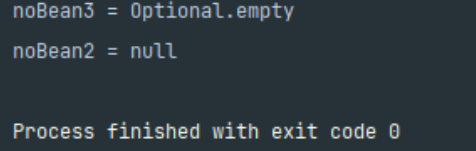

# 옵션 처리

주입할 스프링 빈이 없어도 동작해야 할 때가 있다.

그런데 `@Autowired` 만 사용하면 `required` 옵션의 기본값이 `true` 로 되어 있어서 자동 주입 대상이 없으면 오류가 발생한다.

자동 주입 대상을 옵션으로 처리하는 방법은 다음과 같다.

- `@Autowired(required = false)` : 자동 주입할 대상이 없으면 수정자 메서드 자체가 호출 안됨
- `org.springframework.lang.@Nullable` : 자동 주입할 대상이 없으면 null이 입력된다.
- `Optional<>` : 자동 주입할 대상이 없으면 `Optional.empty` 가 입력된다.

### 예제로 확인해보자.

```java
@Autowired(required = false)
        public void setBean1(Member noBean1) {
            System.out.println("noBean1 = " + noBean1);
        }

        @Autowired
        public void setBean2(@Nullable Member noBean2) {
            System.out.println("noBean2 = " + noBean2);
        }

        @Autowired
        public void setBean3(Optional<Member> noBean3) {
            System.out.println("noBean3 = " + noBean3);
        }
```

### 출력결과



- **Member**는 스프링 빈이 아니다.
- `setNoBean1()` 은 `@Autowired(required = false)` 이므로 호출 자체가 안된다.