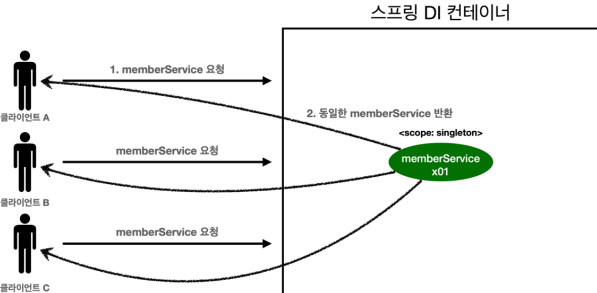
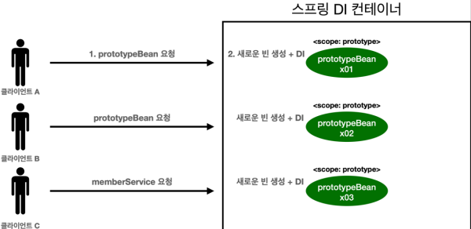
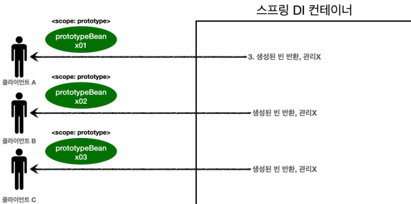

# 프로토타입 스코프

싱글톤 스코프의 빈을 조회하면 스프링 컨테이너는 항상 같은 인스턴스의 스프링 빈을 반환한다. 반면에
프로토타입 스코프를 스프링 컨테이너에 조회하면 스프링 컨테이너는 항상 새로운 인스턴스를 생성해서
반환한다.

**싱글톤 빈 요청**



1. 싱글톤 스코프의 빈을 스프링 컨테이너에 요청한다.
2. 스프링 컨테이너는 본인이 관리하는 스프링 빈을 반환한다.
3. 이후에 스프링 컨테이너에 같은 요청이 와도 같은 객체 인스턴스의 스프링 빈을 반환한다.

**프로토타입 빈 요청1**



1. 프로토타입 스코프의 빈을 스프링 컨테이너에 요청한다.
2. 스프링 컨테이너는 이 시점에 프로토타입 빈을 생성하고, 필요한 의존관계를 주입한다


3. 스프링 컨테이너는 생성한 프로토타입 빈을 클라이언트에 반환한다.
4. 이후에 스프링 컨테이너에 같은 요청이 오면 항상 새로운 프로토타입 빈을 생성해서 반환한다.

**정리**
여기서 **핵심은 스프링 컨테이너는 프로토타입 빈을 생성하고, 의존관계 주입, 초기화까지만 처리한다는 것**이다. 클라이언트에 빈을 반환하고, 이후 스프링 컨테이너는 생성된 프로토타입 빈을 관리하지 않는다.
프로토타입 빈을 관리할 책임은 프로토타입 빈을 받은 클라이언트에 있다. 그래서 `@PreDestroy` 같은 종료
메서드가 호출되지 않는다.

코드로 확인해보자.

**싱글톤 스코프 빈 테스트**

```java
package hello.core.scope;

import org.junit.jupiter.api.Test;
import org.springframework.context.annotation.AnnotationConfigApplicationContext;
import org.springframework.context.annotation.Scope;

import javax.annotation.PostConstruct;
import javax.annotation.PreDestroy;

import static org.assertj.core.api.Assertions.assertThat;

public class SingletonTest {
    @Test
    public void singletonBeanFind() {
        AnnotationConfigApplicationContext ac = new AnnotationConfigApplicationContext(SingletonBean.class);
        SingletonBean singletonBean1 = ac.getBean(SingletonBean.class);
        SingletonBean singletonBean2 = ac.getBean(SingletonBean.class);

        System.out.println("singletonBean1 = " + singletonBean1);
        System.out.println("singletonBean2 = " + singletonBean2);
        assertThat(singletonBean1).isSameAs(singletonBean2);

        ac.close(); //종료
    }

    @Scope("singleton")
    static class SingletonBean {
        @PostConstruct
        public void init() {
            System.out.println("SingletonBean.init");
        }

        @PreDestroy
        public void destroy() {
            System.out.println("SingletonBean.destroy");
        }
    }
}
```

먼저 싱글톤 스코프의 빈을 조회하는 `singletonBeanFind()` 테스트를 실행해보자

**실행 결과**

```
SingletonBean.init
singletonBean1 = hello.core.scope.PrototypeTest$SingletonBean@54504ecd
singletonBean2 = hello.core.scope.PrototypeTest$SingletonBean@54504ecd
org.springframework.context.annotation.AnnotationConfigApplicationContext - 
Closing SingletonBean.destroy
```

- 빈 초기화 메서드를 실행하고,
- 같은 인스턴스의 빈을 조회하고,
- 종료 메서드까지 정상 호출 된 것을 확인할 수 있다

**프로토타입 스코프 빈 테스트**

```java
package hello.core.scope;

import org.junit.jupiter.api.Test;
import org.springframework.context.annotation.AnnotationConfigApplicationContext;
import org.springframework.context.annotation.Bean;
import org.springframework.context.annotation.Scope;

import javax.annotation.PostConstruct;
import javax.annotation.PreDestroy;

import static org.assertj.core.api.Assertions.*;

public class PrototypeTest {
    @Test
    public void prototypeBeanFind() {
        AnnotationConfigApplicationContext ac = new AnnotationConfigApplicationContext(PrototypeBean.class);
        System.out.println("find prototypeBean1");

        PrototypeBean prototypeBean1 = ac.getBean(PrototypeBean.class);
        System.out.println("find prototypeBean2");

        PrototypeBean prototypeBean2 = ac.getBean(PrototypeBean.class);

        System.out.println("prototypeBean1 = " + prototypeBean1);
        System.out.println("prototypeBean2 = " + prototypeBean2);

        assertThat(prototypeBean1).isNotSameAs(prototypeBean2);
        ac.close(); //종료
    }

    @Scope("prototype")
    static class PrototypeBean {
        @PostConstruct
        public void init() {
            System.out.println("PrototypeBean.init");
        }

        @PreDestroy
        public void destroy() {
            System.out.println("PrototypeBean.destroy");
        }
    }
}
```

프로토타입 스코프의 빈을 조회하는 `prototypeBeanFind()` 테스트를 실행해보자.

**실행 결과**

```
find prototypeBean1
PrototypeBean.init
find prototypeBean2
PrototypeBean.init
prototypeBean1 = hello.core.scope.PrototypeTest$PrototypeBean@13d4992d
prototypeBean2 = hello.core.scope.PrototypeTest$PrototypeBean@302f7971
org.springframework.context.annotation.AnnotationConfigApplicationContext - 
Closing 
```

- 싱글톤 빈은 스프링 컨테이너 생성 시점에 초기화 메서드가 실행 되지만, 프로토타입 스코프의 빈은 스프링
  컨테이너에서 빈을 조회할 때 생성되고, 초기화 메서드도 실행된다.
- 프로토타입 빈을 2번 조회했으므로 완전히 다른 스프링 빈이 생성되고, 초기화도 2번 실행된 것을 확인할
  수 있다.
- 싱글톤 빈은 스프링 컨테이너가 관리하기 때문에 스프링 컨테이너가 종료될 때 빈의 종료 메서드가
  실행되지만, 프로토타입 빈은 스프링 컨테이너가 생성과 의존관계 주입 그리고 초기화 까지만 관여하고,
  더는 관리하지 않는다. 따라서 프로토타입 빈은 스프링 컨테이너가 종료될 때 @PreDestroy 같은 종료
  메서드가 전혀 실행되지 않는다.

**프로토타입 빈의 특징 정리**

- 스프링 컨테이너에 요청할 때 마다 새로 생성된다.
- 스프링 컨테이너는 프로토타입 빈의 생성과 의존관계 주입 그리고 초기화까지만 관여한다.
- 종료 메서드가 호출되지 않는다.
- 그래서 프로토타입 빈은 프로토타입 빈을 조회한 클라이언트가 관리해야 한다. 종료 메서드에 대한 호출도
  클라이언트가 직접 해야한다.
