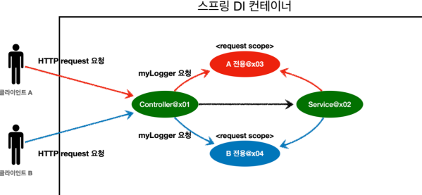

# 웹 스코프

지금까지 싱글톤과 프로토타입 스코프릃 학습했다. 싱글톤은 스프링 컨테이너의 시작과 끝까지 함께하는 매우 긴 스코프이고, 프로토타입은 생성과 의존관계 주입, 그리고 초기화까지만 진행하는 특별한 스코프이다.

## 웹 스코프의 특징
- 웹 스코프는 이름답게 웹 환경에서 동작
- 웹 스코프는 프로토타입과 다르게 스프링이 해당 스코프의 종료시점까지 관리, 따라서 종료 메서드가 호출된다

## 웹 스코프 종류
- **request**: HTTP 요청 하나가 들어오고 나갈 때까지 유지되는 스코프, 각각의 요청마다 별도의 인스턴스가 생성되고 관리된다.
- **session**: HTTP Session과 동일한 생명주기를 가지는 스코프
- **application**: 서블릿 컨텍스트(`ServletContext`)와 동일한 생명주기를 가지는 스코프
- **websocket**: 웹 소켓과 동일한 생명주기를 가지는 스코프

**HTTP request 요청 당 각각 할당되는 request 스코프**

