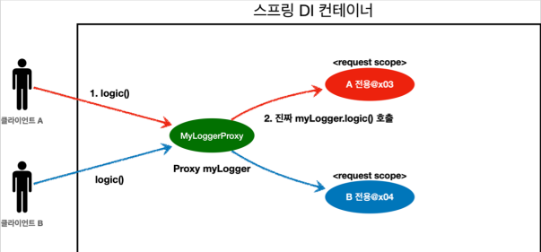

# 스코프와 프록시

```java

@Component
@Scope(value = "request", proxyMode = ScopedProxyMode.TARGET_CLASS)
public class MyLogger {
}
```

- `proxyMode = ScopedProxyMode.TARGET_CLASS`를 추가해주자.
    - 적용 대상이 인터페이스가 아닌 클래스면 `TARGET_CLASS`를 선택
    - 적용 대상이 인터페이스면 `INTERFACES`를 선택
- 어떻게 하면 MyLogger의 가짜 프록시 클래스를 만들어두고 HTTP request와 상관 없이 가짜 프록시

클래스를 다른 빈에 미리 주입해 둘 수 있다.

이제 나머지 코드를 Provider 사용 이전으로 돌려두자.

```java
package hello.core.web;

import hello.core.common.MyLogger;
import hello.core.logdemo.LogDemoService;
import lombok.RequiredArgsConstructor;
import org.springframework.stereotype.Controller;
import org.springframework.web.bind.annotation.RequestMapping;
import org.springframework.web.bind.annotation.ResponseBody;

import javax.servlet.http.HttpServletRequest;

@Controller
@RequiredArgsConstructor
public class LogDemoController {
    private final LogDemoService logDemoService;
    private final MyLogger myLogger;

    @RequestMapping("log-demo")
    @ResponseBody
    public String logDemo(HttpServletRequest request) {
        String requestURL = request.getRequestURL().toString();
        myLogger.setRequestURL(requestURL);
        myLogger.log("controller test");
        logDemoService.logic("testId");
        return "OK";
    }
}
```

```java
package hello.core.logdemo;

import hello.core.common.MyLogger;
import lombok.RequiredArgsConstructor;
import org.springframework.stereotype.Service;

@Service
@RequiredArgsConstructor
public class LogDemoService {
    private final MyLogger myLogger;

    public void logic(String id) {
        myLogger.log("service id = " + id);
    }
}
```

실행해보면 잘 동작하는 것을 확인할 수 있다

코드를 잘보면 `LogDemoController`, `LogDemoService`는 Provider 사용 전과 완전히 동일하다 어떻게 된 것일까

## 웹 스코프와 프록시 동작 원리

먼저 주입된 myLogger를 확인해보자.
`System.out.println("myLogger = " + myLogger.getClass());`

**출력결과**
```java
myLogger = class hello.core.common.MyLogger$$EnhancerBySpringCGLIB$$b68b726d
```

**CGLIB라는 라이브러리로 내 클래스를 상속 받는 가짜 프록시 객체를 만들어 주입한다.**

- `@Scope` 의 `proxyMode = ScoeProxyMode.TARGET_CLASS`를 설정하면 스프링 컨테이너는 CGLIB 라는 바이트코드를 조작하는 라이브러리를 사용해서, MyLogger를 상속받은 가짜 프록시 객체를 생성한다.
- 결과를 확인해보면 우리가 등록한 순수한 MLogger 클래스가 아니라 `MyLogger$$EnhancerBySpringCGLIB` 이라는 클래스로 만들어진 객체가 대신 등록된 것을 확인할 수 있다.
- 그래서 의존관계도 주입도 이 가짜 프록시 객체가 주입된다.



**가짜 프록시 객체는 요청이 오면 그때 내부에서 진짜 빈을 요청하는 위임 로직이 들어있다.**
- 가짜 프록시 객체는 내부에 진짜 myLogger를 찾는 방법을 알고 있다
- 클라이언트가 `myLogger.logic()`을 호출하며너 사실은 가짜 프록시 객체의 메서드르 호출한 것이다.
- 가짜 프록시 객체는 request 스코프의 진짜 `myLogger.logic()`을 호출한다
- 가짜 프록시 객체는 원본 클래스를 상속 받아서 만들어졌기 때문에 이 객체를 사용하는 클라이언트 입장에서는 사실 원본인지 아닌지도 모르게, 동일하게 사용할 수 있다

## 동작 정리

- CGLIB 라이브러리로 내 클래스를 상속받은 프록시 객체를 만들어 주입한다
- 이 프록시 객체는 실제 요청이 오면 그때 내부에서 실제 빈을 요청하는 위임 로직이 들어온다
- 프록시 객체는 실제 request scope와는 관계가 없다. 내부에 단순한 위임 로직만 있고, 싱글톤 처럼 동작한다

## 특징 정리
- 프록시 객체 덕분에 클라이언트는 마치 싱글톤 빈을 사용하듯이 편리하게 request scope를 사용할 수 있다
- 사실 Provider를 사용하든, 프록시를 사용하든 핵심 아이디어는 진짜 객체 조회를 꼭 **필요한 시점까지 지연한다는 점**이다.
- 단지 애노테이션 설정 변경만으로 원본 객체를 프록시 객체로 대체할 수 있다. 이것이 바로 다형성과 DI 컨테이너가 가진 큰 강점이다.
- 꼭 웹 스코프가 아니어도 프록시는 사용할 수 있다

### 주의점

- 마치 싱글톤을 사용하는 것 같지만 다르게 동작하기 때문에 결국 주의해서 사용해야 한다.
- 이런 특별한 scope는 꼭 필요한 곳에만 최소화해서 사용하자. 무분별하게 사용하면 유지보수하기 어려워진다.

